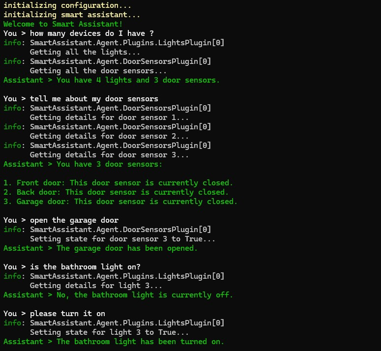

# Smart Assistant

This repository shows how to use [Semantic Kernel](https://learn.microsoft.com/en-us/semantic-kernel/overview/) to build a smart assistant for home automation.

The agent connects to an Azure OpenAI instance and leverages custom [Plugins](https://learn.microsoft.com/en-us/semantic-kernel/concepts/plugins/?pivots=programming-language-csharp) to execute HTTP calls to an Azure Function. This API takes care of managing some "smart" sensors like lights and door sensors.

